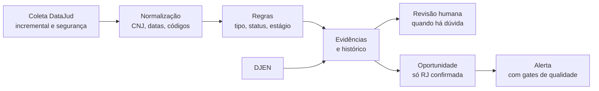

# Antevê: Escopo Funcional

Versão 1.0 | 22/09/2026 | Joao Zocarato

## 1. Visão geral

O Antevê é um radar nacional de recuperações judiciais: detecta pedidos de RJ nos 27 Tribunais de Justiça logo após a disponibilização na fonte oficial, organiza as evidências, separa fato processual de inferência comercial e gera oportunidades auditáveis. Este documento descreve a versão em produção (regras `regras-2026.09.22`) e serve como escopo funcional para reimplementação no ambiente SBK.

**Público:** escritórios de advocacia e equipes de legal ops que atuam com credores, recuperandas e administradores judiciais.

**Princípios que valem para todo o sistema:**

1. **Duas camadas independentes.** A camada confirmada só afirma que existe RJ com fonte oficial (metadado do DataJud, publicação oficial ou documento do processo). A camada preventiva calcula um score explicável de sinais e é sempre rotulada como "Recuperação judicial não confirmada".
2. **Falha de fonte nunca é ausência de processo.** Se uma fonte não responde, o cursor não avança e a tela de saúde mostra o motivo.
3. **A IA nunca é fonte primária.** O classificador só é acionado sobre texto oficial já coletado, e a resposta passa por regras determinísticas antes de ser aceita.
4. **Toda decisão é rastreável.** Cada processo guarda motivos, versão da regra, evidências com URL e hash, e histórico de alterações.
5. **Contato comercial bloqueado por padrão.** Só é liberado com CNPJ verificado, status confirmado, sem pendência de revisão e sem opt out.
6. **Linguagem jurídica controlada.** Alertas usam apenas as expressões permitidas e terminam com "Classificação sujeita a validação jurídica".

## 2. Fontes de dados

Quatro fontes públicas alimentam o sistema. O DataJud é a fonte principal de detecção; as demais completam identidade, partes e dicionário.

| Fonte | Para que serve | O que traz | Limitações |
| --- | --- | --- | --- |
| DataJud (API Pública do CNJ) | Detecção de processos | Número CNJ, tribunal, vara, classe, assuntos, movimentos, datas, nível de sigilo | Não traz partes nem CNPJ; atraso médio de cerca de 24 dias entre ajuizamento e disponibilização |
| DJEN (Diário de Justiça Eletrônico Nacional) | Evidência oficial, partes e CNPJ | Texto da publicação, destinatários por polo, advogados com OAB, link | Bloqueia acessos de fora do Brasil; só existe depois da primeira publicação do processo |
| TPU/SGT do CNJ | Dicionário de códigos | Classes, assuntos e movimentos vigentes | Versionada; muda periodicamente |
| Cadastro CNPJ (dados abertos da Receita via BrasilAPI) | Enriquecimento cadastral | Razão social, nome fantasia, município, UF, CNAE, porte, situação | O quadro societário não é armazenado (minimização de dados pessoais) |

**Particularidades do DataJud validadas em 22/09/2026:**

- O campo `dataAjuizamento` é gravado no formato compacto `yyyyMMddHHmmss`, e o filtro por faixa só funciona nesse formato. O formato ISO retorna resultados errados.
- O cursor incremental usa `dataHoraUltimaAtualizacao`, em formato ISO.
- A paginação usa `search_after` em streaming, 100 registros por página, para não acumular em memória processos com milhares de movimentos.
- A chave pública é divulgada pelo CNJ e pode mudar; ela é configurável em `DATAJUD_API_KEY`.

**Tratamento de falhas (todas as fontes):**

- Retentativas com espera exponencial e variação aleatória, respeitando o cabeçalho `Retry-After`.
- HTTP 401 ou 403 gera "fonte indisponível" com o motivo (chave, termos ou bloqueio geográfico).
- Resposta sem os campos obrigatórios (`numeroProcesso`, `classe`, `tribunal`) gera "mudança de esquema": o conector para e a equipe é alertada.
- Nenhuma falha é convertida em "nenhum processo encontrado".

## 3. Fluxo funcional

Cada registro percorre sete etapas, da coleta até o alerta. O processamento é idempotente pelo número CNJ: reprocessar o mesmo registro nunca cria duplicata.

O DJEN entra em paralelo, completando evidência oficial, partes e CNPJ de processos já detectados.

### 3.1 Coleta incremental

- **Classes monitoradas:** 129 (Recuperação Judicial), 128 (Recuperação Extrajudicial) e 108 (Falência).
- **Cursor por tribunal:** última `dataHoraUltimaAtualizacao` processada. A próxima coleta começa no cursor menos uma janela sobreposta de 72 horas, para recuperar registros indexados com atraso.
- **Primeira coleta:** sem cursor, busca os processos atualizados nos últimos 30 dias.
- **Janela de captura:** só entram processos ajuizados nos últimos 365 dias.
- **Execução parcial:** se o prazo da execução acabar, o cursor grava o último registro processado e a próxima chamada retoma exatamente dali, sem sobreposição. A saúde do tribunal fica PARCIAL.
- **Falha:** o cursor não avança; a janela sobreposta recupera o que faltou.

### 3.2 Consulta de segurança

Na mesma coleta, o sistema procura os movimentos 12041 (Concedida a recuperação judicial) e 202 (Decretação de falência) em processos **fora** das classes monitoradas. O objetivo é capturar erros de autuação. Esses processos entram só como CANDIDATO e vão para revisão humana.

### 3.3 Reconciliação

Consulta por data de ajuizamento, independente do cursor, para garantir cobertura:

| Reconciliação | Janela | Frequência |
| --- | --- | --- |
| Diária | Últimos 30 dias | Uma vez por dia (Vercel Cron às 9h UTC, 6h de Brasília) |
| Mensal | Últimos 365 dias | A cada 30 dias, ou pela linha de comando na carga inicial |

### 3.4 Enriquecimento pelo diário (DJEN)

- **Alvos:** processos de RJ com status Confirmado, Atualizado ou Provisório que ainda não têm publicação oficial ou não têm partes.
- **Ordem:** primeiro os nunca consultados, depois os consultados há mais tempo; dentro disso, os ajuizados mais recentemente.
- **Espera de 24 horas:** um processo consultado só volta à fila depois de 24 horas, para um processo sem publicação não bloquear os demais.
- **Orçamento:** usa o tempo que sobra em cada lote da coleta.
- **Vínculo:** uma publicação só é incorporada se o número CNJ dela for igual ao do processo.

### 3.5 Normalização

- **Número CNJ:** formatado no padrão `NNNNNNN-DD.AAAA.J.TR.OOOO` e validado pelo dígito verificador.
- **CNPJ:** validado pelo dígito verificador, inclusive no formato alfanumérico.
- **Datas:** convertidas para o fuso de Brasília.
- **Razão social:** maiúsculas, espaços normalizados e remoção do sufixo "em recuperação judicial".
- **Comarca:** extraída do nome do órgão julgador por heurística, porque o DataJud não traz o campo.

### 3.6 Deduplicação e histórico

- **Chave do processo:** número CNJ válido; sem ele, tribunal mais o identificador da fonte.
- **Registro bruto:** todo payload recebido é guardado com hash, para auditoria e reprocessamento.
- **Histórico:** mudanças em status, estágio, tipo de evento, classe, prioridade, vara e processo principal são gravadas com valor anterior, novo e motivo.
- **Retificação de data:** se a fonte muda a data de ajuizamento, o sistema mantém a original (a idade do pedido não reinicia) e registra a divergência.
- **Reprocessamento:** após vínculo de identidade, decisão de revisão ou nova publicação, as regras são reaplicadas sobre o último registro bruto.

## 4. Regras de classificação

Um motor de regras determinístico decide, para cada registro, o tipo de evento, o status, o estágio, a rota, a confiança, a prioridade e se o contato fica bloqueado. A função é pura (sem chamadas de rede) e cada decisão grava seus motivos e a versão da regra.

### 4.1 Dicionário TPU

Nenhuma regra usa código fixo fora do dicionário. Cada código tem um efeito semântico. O dicionário é versionado com hash e pode ser conferido no SGT/CNJ (botão Sincronizar TPU).

| Tabela | Código | Nome | Efeito na regra |
| --- | --- | --- | --- |
| Classe | 129 | Recuperação Judicial | RJ |
| Classe | 128 | Recuperação Extrajudicial | Camada separada (RE) |
| Classe | 108 | Falência | Pedido de falência (preventivo) |
| Classe | 111, 114, 38, 14991, 138 | Habilitação, impugnação, classificação de crédito, restituição | Incidente: descartado |
| Classe | 166, 167 | Insolvência civil | Descartado |
| Assunto | 4993, 5000, 9558 | RJ e Falência, Concurso de Credores, Administração judicial | Neutro |
| Assunto | 4994 | Recuperação extrajudicial | Divergência |
| Assunto | 9556 | Convolação em falência | Divergência se não houver decreto |
| Assunto | 9559 | Classificação de créditos | Divergência (típico de incidente) |
| Assunto | 10179 | Liquidação extrajudicial | Divergência |
| Movimento | 26 | Distribuição | Pedido novo |
| Movimento | 12041 | Concedida a recuperação judicial | RJ concedida |
| Movimento | 202 | Decretada a falência | Convolação em falência |
| Movimento | 12444 | Deferido o pedido | Indício de deferimento |
| Movimento | 12455 | Indeferido o pedido | Indício de indeferimento |
| Movimento | 454 | Indeferida a petição inicial | Indeferido |
| Movimento | 463 | Extinto por desistência | Desistência |
| Movimento | 83, 488 | Cancelamento da distribuição | Cancelado |
| Movimento | 22 | Baixa definitiva | Baixado |
| Movimento | 36, 14738, 14739, 928, 11983 | Redistribuição, retificação de classe, republicação, retificação de movimento | Registrados como evento |

Quando um código local não está no dicionário, o sistema tenta o efeito pelo nome do item.

### 4.2 Ordem de decisão

1. **Sigilo:** processo com nível de sigilo maior que zero é excluído, sem persistir metadados.
2. **Classe fora de RJ:**
   - Recuperação extrajudicial: tipo RE\_EXTRAJUDICIAL, camada separada, não soma como RJ.
   - Falência: tipo PEDIDO\_FALENCIA, sinal preventivo, não é RJ.
   - Incidente ou insolvência civil: descartado.
   - Outra classe vinda da consulta de segurança com RJ concedida ou falência: CANDIDATO em revisão manual (possível erro de autuação). Sem esse ato: descartado.
3. **Classe 129:** tipo RJ\_PEDIDO\_NOVO, pedido confirmado por metadado oficial (nível B).
4. **Divergências:** assuntos divergentes, distribuição por dependência, publicação indicando extrajudicial ou mera menção, CNJ inválido ou data ausente.
5. **Janela de captura:** ajuizamento há mais de 365 dias em processo novo: descartado.
6. **Estágio e tipo final:** pelos atos decisivos (item 4.3).
7. **Status e rota:** com divergência, PROVISÓRIO na rota D; sem divergência, CONFIRMADO (rota C se houver publicação oficial de deferimento ou distribuição, senão rota A). Estágio terminal vira ENCERRADO. Qualquer pendência de revisão rebaixa CONFIRMADO para PROVISÓRIO.

### 4.3 Estágio processual

O estágio segue o último ato decisivo, em ordem cronológica. Publicação oficial tem precedência sobre movimento genérico.

| Estágio | Quando |
| --- | --- |
| Distribuído, aguardando decisão | Estado inicial |
| Indício de deferimento | Movimento genérico "Deferido o pedido" (confirmar) |
| Indício de indeferimento | Movimento genérico "Indeferido o pedido" (abre revisão) |
| Processamento deferido | Publicação com "defiro o processamento" ou nomeação de administrador judicial |
| Concedida | Movimento 12041 |
| Convolada em falência | Movimento 202 ou publicação de convolação |
| Indeferido | Movimento 454 ou publicação de indeferimento |
| Desistência | Movimento 463 |
| Distribuição cancelada | Movimentos 83 ou 488 |
| Baixado | Movimento 22 |

Os cinco últimos são terminais: o processo sai da fila de nova RJ e a oportunidade é encerrada.

**Atos lidos nas publicações** (por termos, sem IA): deferimento, indeferimento, convolação, tutela cautelar antecedente, edital de credores, distribuição, recuperação extrajudicial e mera menção. Tutela antecedente muda o tipo para RJ\_TUTELA\_ANTECEDENTE.

### 4.4 Tipos de evento

| Tipo | Significado | Camada |
| --- | --- | --- |
| RJ\_PEDIDO\_NOVO | Pedido de RJ distribuído | RJ |
| RJ\_TUTELA\_ANTECEDENTE | Tutela cautelar preparatória | RJ |
| RJ\_PROCESSAMENTO\_DEFERIDO | Processamento deferido | RJ |
| RJ\_PROCESSAMENTO\_INDEFERIDO | Pedido indeferido | RJ |
| RJ\_PLANO\_APRESENTADO | Plano apresentado | RJ |
| RJ\_CONCEDIDA | RJ concedida | RJ |
| RJ\_FALENCIA | Convolação em falência | RJ |
| RE\_EXTRAJUDICIAL | Recuperação extrajudicial | Falência e extrajudicial |
| PEDIDO\_FALENCIA | Pedido de falência | Falência e extrajudicial |
| INCIDENTE\_RELACIONADO | Incidente de RJ | Descartado |
| REVISAO\_MANUAL | Ato recuperacional fora da classe RJ | Revisão |
| NAO\_RELACIONADO | Fora do escopo | Descartado |

### 4.5 Status

| Status | Significado |
| --- | --- |
| Confirmado | RJ com fonte oficial e sem divergência |
| Atualizado | Já confirmado, mudou de estágio ou tipo |
| Provisório | Divergência ou pendência de revisão |
| Candidato | Veio da consulta de segurança; exige confirmação |
| Encerrado | Estágio terminal |
| Descartado | Fora do escopo; não aparece nas listas |

### 4.6 Idade do pedido

Contada a partir da data de ajuizamento: **Novo** até 7 dias, **Recente** de 8 a 30 dias, **Histórico** acima de 30 dias. Os limites são configuráveis (`ANTEVE_NOVO_DIAS`, `ANTEVE_RECENTE_DIAS`).

### 4.7 Prioridade

| Situação | Prioridade |
| --- | --- |
| Fora da camada RJ, descartado ou estágio terminal | Monitoramento |
| Ajuizado há até 1 dia | Urgente |
| Ajuizado há até 7 dias | Alta |
| 8 a 30 dias, aguardando decisão, com indício de deferimento ou deferido | Alta |
| 8 a 30 dias, demais estágios | Média |
| Acima de 30 dias, deferido ou com indício, até 90 dias | Média |
| Acima de 30 dias, demais casos | Monitoramento |
| Sem data de ajuizamento | Média |

Grupo econômico com mais de uma recuperanda sobe a prioridade um nível.

### 4.8 Confiança

- **Base pela rota:** A e B 0,90; C 0,93; D 0,60.
- **Acréscimos:** CNPJ verificado +0,05; publicação oficial de nível A ou B +0,03.
- **Redutores:** qualquer divergência limita a 0,50; OCR de baixa qualidade -0,15.
- **Teto sem identidade:** sem CNPJ verificado e sem publicação oficial, o máximo é 0,70.
- **Revisão humana:** confirmação manual eleva para pelo menos 0,85 com CNPJ, ou 0,70 sem CNPJ.
- **Faixa final:** entre 0 e 0,99; descartado vale 0.

### 4.9 Contato bloqueado

O contato comercial fica bloqueado quando qualquer condição abaixo vale: empresa sem CNPJ verificado, status diferente de Confirmado ou Atualizado, CNPJ em opt out, ou pendência de revisão.

## 5. Identidade e partes

Como o DataJud não informa partes nem CNPJ, todo processo detectado só por ele entra sem empresa vinculada, com confiança máxima de 0,70 e contato bloqueado. A identidade vem de publicações do DJEN ou de vínculo manual com evidência.

### 5.1 Vínculo de CNPJ

- **Automático pelo DJEN:** o CNPJ encontrado a até cerca de 220 caracteres antes de uma âncora de requerente (recuperanda, requerente, autora, devedora, "requer o processamento") e longe de âncoras de terceiro (credor, impugnante, habilitante, réu, requerida, terceiro interessado) é vinculado como requerente, com evidência de nível B.
- **CNPJ sem papel claro:** abre revisão na fila Identidade, sem vínculo automático.
- **Nome sem CNPJ:** nunca cria vínculo de identidade, para não unir homônimos.
- **Manual:** o analista informa CNPJ, papel (Requerente ou Litisconsorte) e URL da evidência (capa, inicial, decisão ou publicação). A evidência é obrigatória.
- **Validação:** o CNPJ precisa passar no dígito verificador, inclusive no formato alfanumérico.
- **Cadastro:** no vínculo, o sistema consulta o cadastro da Receita e grava razão social, nome fantasia (como nome alternativo), município, UF, CNAE, porte e situação.
- **Efeitos:** a revisão de identidade pendente é fechada, a quantidade de recuperandas é atualizada e o processo é reprocessado (confiança, prioridade e contato).

### 5.2 Partes do processo

- **Origem automática:** destinatários das publicações do DJEN, com polo (A vira Polo ativo, P vira Polo passivo), e advogados com número e UF da OAB.
- **Deduplicação:** a mesma parte no mesmo polo e tipo é gravada uma única vez, comparando o nome sem acentos e sem diferença de maiúsculas.
- **Inclusão manual:** perfis com permissão de revisão incluem nome, polo (ativo, passivo ou outros), tipo (parte ou advogado), OAB e a URL da consulta processual do tribunal como evidência.
- **Busca:** a pesquisa da lista encontra processos pelo nome de parte ou advogado, ignorando acentos e maiúsculas.
- **Minimização:** são gravados apenas nome, polo e OAB. Nenhum documento de pessoa física é armazenado.
- **Partes não substituem identidade:** o nome de uma parte não libera contato; só o CNPJ verificado libera.

### 5.3 Níveis de evidência

| Nível | Exemplo | Uso |
| --- | --- | --- |
| A | Documento do processo validado por humano (capa, inicial, decisão) | Vínculo manual de identidade |
| B | Metadado oficial do DataJud; publicação oficial vinculada ao CNJ | Confirmação automática |
| C | Fonte licenciada ou comunicado da própria empresa | Sinais preventivos |
| D | Notícia isolada ou texto sem vínculo ao CNJ | Nunca confirma; peso limitado no preventivo |

Cada evidência guarda fonte, URL, trecho resumido, data de coleta, hash do documento, versão da regra e se foi gerada por IA (evidência de IA nunca é primária).

## 6. Camada preventiva

A camada preventiva calcula, por CNPJ, um score de 0 a 100 a partir de sinais públicos ou licenciados. O resultado é sempre rotulado "Recuperação judicial não confirmada", nunca é exportado nem publicado em lista, e o acesso é restrito aos perfis admin e analista.

### 6.1 Catálogo de sinais

| Sinal | Peso | Validade (dias) |
| --- | --- | --- |
| Tutela cautelar antecedente explicitamente preparatória | 35 | 90 |
| Fato relevante ou comunicado da empresa sobre negociação coletiva ou risco de RJ | 30 | 90 |
| Pedido de falência ativo | 20 | 180 |
| Crescimento relevante de execuções frente à linha de base | 15 | 90 |
| Múltiplos protestos ou restrições em fonte licenciada | 15 | 60 |
| Atraso público relevante com credores ou empregados, confirmado | 10 | 60 |
| Fechamento de unidades ou demissão coletiva anunciada | 8 | 90 |
| Notícia isolada sem confirmação primária | 3 | 30 |
| Quitação ou acordo com credores comprovado (negativo) | -15 | 180 |
| Extinção do pedido de falência (negativo) | -20 | 180 |
| Esclarecimento oficial afastando o risco (negativo) | -10 | 90 |

Pedidos de falência detectados pelo DataJud contra empresa com CNPJ verificado viram automaticamente o sinal "Pedido de falência ativo".

### 6.2 Regras de cálculo

- **Fonte obrigatória:** sinal sem fonte ou sem URL vale zero. O cadastro de sinal também rejeita sinal sem fonte e URL.
- **Data obrigatória:** sinal sem data vale zero.
- **Expiração:** passado o prazo de validade, o sinal vale zero e aparece como expirado.
- **Nível D:** sinal de nível D nunca vale mais que uma notícia isolada (3 pontos).
- **Salvaguarda:** se o total atingir 50 mas a parte vinda de fontes confiáveis (níveis A, B ou C) for menor que 50, o score é limitado a 49. Nenhum conjunto de sinais fracos leva sozinho a risco elevado.
- **Limites:** o score fica entre 0 e 100.
- **Duplicidade:** o mesmo sinal com o mesmo tipo e URL não é somado duas vezes.
- **Recálculo:** a cada ciclo de coleta, para aplicar as expirações.

### 6.3 Faixas

| Score | Faixa | Efeito |
| --- | --- | --- |
| 0 a 24 | Monitoramento | Nenhum |
| 25 a 49 | Atenção | Nenhum |
| 50 a 69 | Risco elevado | Abre revisão na fila Preventivo |
| 70 a 100 | Prioridade de análise humana | Abre revisão na fila Preventivo |

### 6.4 Revisão humana obrigatória

Com `ANTEVE_PREVENTIVO_REVISAO=1` (padrão recomendado), nenhum alerta preventivo sai sem aprovação. A decisão "Aprovar preventivo" marca o score como revisado e dispara o alerta só para quem optou por receber preventivos e tem permissão. Se o score mudar, a marcação de revisado cai e uma nova revisão é aberta.

## 7. Classificador de IA

O classificador está implementado e testado, mas **não é acionado no fluxo atual**: nenhuma etapa da coleta o chama. Toda a classificação em produção é feita pelas regras determinísticas da seção 4. Na reimplementação, ligar a IA é uma decisão de escopo.

**Como foi desenhado para funcionar:**

- **Gatilho:** só quando já existe texto oficial coletado; sem documento, a IA não é chamada.
- **Modelo:** configurável em `ANTEVE_MODELO_IA`, temperatura 0, ativado por `ANTHROPIC_API_KEY`.
- **Entrada:** registro normalizado, textos públicos coletados e dicionário TPU vigente.
- **Saída:** JSON com uma das 14 categorias, empresa requerente com CNPJ, número CNJ, processo principal, data do evento, estágio, fundamentos, evidências, divergências, confiança e necessidade de revisão humana.
- **Instruções do prompt:** confirmar só com número processual e evidência oficial; não tratar incidentes como pedido novo; não confundir RJ com extrajudicial, falência, insolvência ou liquidação; distinguir requerente de credores e terceiros; exigir CNPJ; não inventar dados; apontar evidência para cada conclusão.

**Regras aplicadas depois da resposta (sempre, independentemente do modelo):**

1. Texto fora do JSON ou JSON inválido: resposta rejeitada.
2. Categoria fora da lista: rejeitada.
3. "Confirmado" sem número CNJ e evidência de nível A ou B: rebaixado para não confirmado.
4. CNPJ que não aparece literalmente nos textos fornecidos, ou com dígito inválido: descartado.
5. Sem CNPJ ou sem documento oficial: confiança limitada a 0,70.
6. Qualquer divergência: revisão humana obrigatória.
7. Sinal preventivo: recebe o texto "Recuperação judicial não confirmada" e nunca é confirmado.
8. Conclusão sem evidência apontada: revisão humana obrigatória.

Cada execução é auditada com modelo, versão do prompt, hash da entrada, tokens, resposta bruta, aceitação e rejeições.

## 8. Oportunidades, alertas e notificações

Só uma RJ confirmada e ativa vira oportunidade comercial, e só mudanças relevantes geram alerta. Provisórios e descartados nunca geram alerta de nova RJ.

### 8.1 Oportunidades

- **Criação automática:** tipo de RJ, status Confirmado ou Atualizado e estágio não terminal. Nasce com status de funil NOVA.
- **Encerramento automático:** quando o processo sai do ciclo (estágio terminal, descarte ou rebaixamento), com o motivo no histórico.
- **Funil:** NOVA, EM\_ANALISE, CONTATO\_AUTORIZADO, CONTATADA, PROPOSTA, GANHA, PERDIDA, ENCERRADA.
- **Trava de contato:** os estágios Contato autorizado, Contatada e Proposta são recusados enquanto o contato estiver bloqueado.
- **Campos editáveis:** responsável, status do funil, registro de contato e motivo de encerramento. Cada alteração entra no histórico da oportunidade e na auditoria.

### 8.2 Gates de alerta

| Tipo de alerta | Quando é gerado |
| --- | --- |
| Nova RJ identificada | Processo de RJ passa a Confirmado pela primeira vez, fora de estágio terminal |
| Atualização | RJ já confirmada muda de estágio ou de tipo de evento |
| Correção | RJ antes confirmada é rebaixada para Provisório ou Descartado; vai para todos que receberam o original |
| Preventivo | Somente após aprovação humana do score |

**Assuntos padronizados** (barra vertical como separador, por norma interna de escrita):

- Nova recuperação judicial identificada | empresa | UF
- Atualização de recuperação judicial | evento | empresa
- Sinal preventivo para análise | recuperação não confirmada | empresa
- Correção de alerta anterior | empresa | número CNJ

**Conteúdo do alerta:** empresa e CNPJ, número CNJ, tribunal, UF, vara, evento, estágio, datas de ajuizamento e descoberta, resumo, evidências com nível e URL, link oficial, confiança, divergências, contato bloqueado, próxima ação sugerida e a frase "Classificação sujeita a validação jurídica".

**Próxima ação por estágio:**

| Estágio | Próxima ação |
| --- | --- |
| Distribuído, aguardando decisão | Validar identidade da requerente e avaliar apoio antes da decisão de processamento |
| Indício de deferimento | Confirmar o deferimento em documento oficial e identificar o administrador judicial |
| Processamento deferido | Mapear prazos do art. 52 e preparar abordagem consultiva |
| Concedida | Acompanhar cumprimento do plano |
| Demais | Analisar evidências e atualizar o funil |

### 8.3 Canais e preferências

- **Canais:** painel (sempre), e-mail (SMTP), webhook (JSON), Slack e Teams (incoming webhook).
- **Filtros por usuário:** tribunais, UFs e tipos de evento. Alertas de correção ignoram o filtro de evento.
- **Frequência:** imediata ou resumo diário.
- **Preventivo:** só para admin e analista que marcaram "receber alertas preventivos".
- **Idempotência:** o mesmo alerta nunca é enviado duas vezes ao mesmo usuário e canal.
- **Falhas de envio:** registradas com o erro, sem interromper os demais envios.

## 9. Revisão humana

Toda dúvida de classificação, identidade ou score elevado vira um item em uma de três filas, e toda decisão exige justificativa de pelo menos 10 caracteres.

| Fila | Quando abre | Decisões possíveis |
| --- | --- | --- |
| Classificação | Divergência, status Provisório ou Candidato, correção solicitada | Confirmar, Descartar, Manter provisório |
| Identidade | RJ sem CNPJ verificado; CNPJ em publicação sem papel claro | Descartar, Manter provisório (o vínculo de CNPJ fecha a revisão) |
| Preventivo | Score em Risco elevado ou Prioridade de análise humana | Aprovar preventivo, Rejeitar preventivo |

**Efeitos das decisões:**

- **Confirmar:** o processo provisório passa a Confirmado na próxima aplicação das regras, com confiança mínima de 0,85 (com CNPJ) ou 0,70 (sem CNPJ).
- **Descartar:** o processo é descartado e sai das listas. Descartar na fila Identidade também fecha a revisão de classificação pendente.
- **Manter provisório:** grava a justificativa e o revisor, mas a revisão continua aberta.
- **Aprovar preventivo:** marca o score como revisado e dispara o alerta preventivo.
- **Precedência:** a decisão humana prevalece sobre a regra automática nas coletas seguintes.
- **Sem reabertura:** uma revisão já decidida com o mesmo motivo não é reaberta.

**Correções:** qualquer perfil pode abrir uma correção sobre um processo ou CNPJ, com os tipos Duplicidade, Erro, Encerramento, Identidade incorreta e Contestação da empresa. A correção sobre processo abre um item na fila Classificação.

## 10. Acesso e segurança

O acesso tem três barreiras em sequência: rede autorizada, login com senha e permissão do perfil. Toda ação sensível vai para a auditoria.

### 10.1 Perfis e permissões

| Permissão | Admin | Analista | Comercial | Leitor |
| --- | --- | --- | --- | --- |
| Ler processos, alertas e métricas | Sim | Sim | Sim | Sim |
| Revisar (filas, vínculo de CNPJ, partes) | Sim | Sim | Não | Não |
| Camada preventiva | Sim | Sim | Não | Não |
| Exportar CSV | Sim | Sim | Não | Não |
| Operar o funil comercial | Sim | Não | Sim | Não |
| Administrar (coleta, TPU, usuários, amostra de controle, auditoria) | Sim | Não | Não | Não |

Abrir correção e registrar opt out estão disponíveis para todos os perfis.

### 10.2 Restrição de rede

- Painel e API só respondem aos IPs de `ANTEVE_IPS_PERMITIDOS` (hoje 186.193.236.194 e 179.191.112.34). Os demais recebem 403 antes da tela de login.
- As rotas de agendamento (`/api/cron/*`) ficam fora da restrição, porque são chamadas pelo Vercel Cron e pelo GitHub Actions, e exigem o `CRON_SECRET`. Sem segredo configurado, ficam fechadas.
- Atrás de proxy, o IP vem do `X-Forwarded-For`, que o Vercel sobrescreve. Fora do Vercel, isso depende de `ANTEVE_CONFIAR_PROXY=1`.

### 10.3 Login e sessão

- **Credenciais:** login (3 a 60 caracteres: letras minúsculas, números, ponto, hífen ou sublinhado) e senha.
- **Senha:** guardada apenas como hash PBKDF2-SHA256 com 310 mil iterações e sal aleatório. Senha digitada precisa de ao menos 8 caracteres; a gerada tem 12, sem caracteres ambíguos.
- **Sessão:** token assinado por HMAC-SHA256, com login, validade e versão de sessão; vale em qualquer instância e expira em 12 horas (`ANTEVE_SESSAO_HORAS`).
- **Encerramento forçado:** trocar a senha ou excluir o usuário invalida na hora todas as sessões abertas.
- **Administrador inicial:** criado na primeira execução (`ANTEVE_ADMIN_LOGIN`); `ANTEVE_ADMIN_SENHA` redefine a senha a cada inicialização.
- **Tentativas:** logins com acerto ou falha são auditados com o IP de origem.

### 10.4 Gestão de usuários

O admin inclui usuários (senha digitada ou gerada), gera nova senha e exclui usuários. Não é possível excluir o próprio usuário nem o último administrador ativo. Excluir remove também as preferências de alerta.

### 10.5 Auditoria

São registrados: consultas ao detalhe de processo e à camada preventiva, decisões de revisão, vínculos de identidade, inclusão de partes, exportações, mudanças no funil, opt out, correções, execuções de coleta, versões de TPU, alterações de esquema das fontes, logins e gestão de usuários. A trilha é consultada pela API (`/api/auditoria`, perfil admin); não há tela para ela no painel.

## 11. Governança e LGPD

O sistema aplica minimização de dados e trata o score preventivo como informação de uso interno. O produto deve ser revisado pelo jurídico e pelo encarregado de dados antes de operar comercialmente.

- **Sigilo:** processo com nível de sigilo maior que zero é excluído sem persistir metadados; só fica o registro de exclusão na auditoria.
- **Dados pessoais:** o quadro societário do cadastro CNPJ não é armazenado. Das partes, só nome, polo e OAB. Nenhum CPF é guardado.
- **Preventivo:** nunca é exportado nem publicado em lista, só é visível para admin e analista, e cada consulta é auditada.
- **Opt out:** registrado por CNPJ com motivo e solicitante. Bloqueia contato em todos os processos da empresa e a retira da exportação.
- **Exportação:** CSV com separador ponto e vírgula, apenas RJs confirmadas ou atualizadas. Colunas: número CNJ, tribunal, UF, vara, classe, tipo de evento, estágio, datas de ajuizamento e descoberta, razão social, CNPJ, confiança, prioridade, contato bloqueado, URL da fonte e versão da regra. Cada exportação é auditada.
- **Linguagem:** os alertas usam só expressões permitidas, separam RJ confirmada de sinal preventivo e terminam com "Classificação sujeita a validação jurídica".
- **Correções:** qualquer perfil pode contestar um dado, inclusive em nome da empresa, e a contestação segue para revisão.
- **Retenção:** ainda não há rotina de expurgo; os prazos são uma decisão pendente (seção 14).

## 12. Métricas de sucesso e saúde das fontes

Seis indicadores medem o sistema sobre a operação real. Cobertura e precisão só aparecem depois de uma amostra de controle e das primeiras decisões humanas.

| Indicador | Como é calculado | Meta |
| --- | --- | --- |
| Cobertura confirmada | Processos da amostra oficial de controle encontrados como RJ confirmada, sobre o total da amostra | 95% ou mais |
| Precisão confirmada | 1 menos a proporção de pedidos confirmados que foram descartados em revisão humana | 98% ou mais |
| Latência na fonte | Tempo entre a disponibilização no DataJud e a descoberta, só para processos disponibilizados após a primeira coleta (P50 e P95) | P50 até 2 h; P95 até 24 h |
| Atraso judicial | Tempo entre ajuizamento e descoberta, para pedidos novos e recentes (informativo, inclui o atraso dos tribunais) | Sem meta |
| Deduplicação | 1 menos as correções do tipo Duplicidade sobre o total de processos | 99% ou mais |
| Rastreabilidade | Processos com alerta que têm evidência com fonte, URL e versão da regra | 100% |

A amostra de controle é uma lista de números CNJ de RJs conhecidas, carregada pelo admin (`POST /api/controle`) com a origem. A tela também mostra a distribuição por status, por tipo de evento e as revisões pendentes por fila.

**Saúde das fontes:** cada par fonte e tribunal tem um status.

| Status | Significado |
| --- | --- |
| OK | Última execução concluída, com latência e quantidade de registros |
| PARCIAL | O prazo acabou; a próxima chamada continua do ponto processado |
| INDISPONÍVEL | A fonte falhou; o cursor não avançou e o motivo fica registrado |
| INTERROMPIDO\_ESQUEMA | O formato de retorno mudou; o conector parou e o evento foi auditado |

A tela mostra ainda a versão e o hash da TPU vigente, o cursor de cada tribunal e as 20 execuções mais recentes.

## 13. Arquitetura, implantação e parâmetros

A versão atual é uma aplicação Python 3.12 (FastAPI) com painel em HTML único, publicada como função do Vercel na região de São Paulo (`gru1`), com PostgreSQL e agendamento externo. Também roda em servidor próprio ou Docker, com agendador interno.

### 13.1 Módulos

| Módulo | Responsabilidade |
| --- | --- |
| Orquestrador | Agenda, cursores, retentativas, reconciliações, lotes com orçamento de tempo, saúde |
| Conectores | DataJud, DJEN e cadastro CNPJ, com tratamento comum de falhas |
| Normalização | CNJ, CNPJ (inclusive alfanumérico), datas, nomes |
| TPU | Dicionário versionado e sincronização com o SGT |
| Regras | Taxonomia, exclusões, rotas, estágio, idade, prioridade, confiança |
| Documentos | Leitura determinística de publicações: ato, requerente, administrador judicial |
| Classificador | Prompt de IA e regras posteriores ao modelo (não acionado hoje) |
| Score | Camada preventiva com expiração e salvaguardas |
| Pipeline | Fluxo ponta a ponta, deduplicação, identidade, partes, oportunidades |
| Notificador | Gates, preferências e canais |
| API e painel | Perfis, auditoria, métricas, exportação, telas |

### 13.2 Modelo de dados

25 tabelas: registros brutos, processos, histórico do processo, empresas, partes, vínculo processo e empresa, eventos, evidências, sinais, scores, revisões, oportunidades, alertas, cursores, saúde das fontes, execuções, auditoria, versões da TPU, execuções de IA, opt out, correções, amostra de controle, usuários, estado interno e preferências. Colunas novas são acrescentadas por migração automática na inicialização. O mesmo esquema roda em SQLite (local) e PostgreSQL (produção).

### 13.3 Agendamento em produção

- **Coleta incremental:** GitHub Actions chama `/api/cron/coleta` a cada 10 minutos. Cada chamada processa 6 tribunais em paralelo, com orçamento de 45 segundos, e avança um rodízio; os 27 TJs são percorridos em cerca de 50 minutos.
- **Reconciliação diária:** Vercel Cron chama `/api/cron/reconciliacao?dias=30` às 9h UTC.
- **Carga de 12 meses:** pela linha de comando, porque não cabe no limite de 60 segundos de uma função.
- **Servidor próprio:** agendador interno a cada 45 minutos, na ordem coleta, consulta de segurança, diário, recálculo de scores e reconciliações.

### 13.4 Parâmetros configuráveis

| Variável | Padrão | Função |
| --- | --- | --- |
| `DATABASE_URL` ou `POSTGRES_URL` | vazio (SQLite local) | Banco PostgreSQL |
| `ANTEVE_TRIBUNAIS` | os 27 TJs | Tribunais monitorados |
| `ANTEVE_INTERVALO_MIN` | 45 | Intervalo do agendador interno |
| `ANTEVE_SOBREPOSICAO_H` | 72 | Janela sobreposta da coleta incremental |
| `ANTEVE_JANELA_CAPTURA_DIAS` | 365 | Idade máxima do ajuizamento para entrar |
| `ANTEVE_RECONC_DIARIA_DIAS` / `ANTEVE_RECONC_MENSAL_DIAS` | 30 / 365 | Janelas de reconciliação |
| `ANTEVE_NOVO_DIAS` / `ANTEVE_RECENTE_DIAS` | 7 / 30 | Limites de idade |
| `ANTEVE_PAGINA` | 100 | Tamanho da página no DataJud |
| `ANTEVE_ORCAMENTO_S` / `ANTEVE_PARALELO` | 45 / 6 | Tempo por chamada e tribunais por lote |
| `ANTEVE_PREVENTIVO_REVISAO` | 1 | Exige revisão antes de alerta preventivo |
| `ANTEVE_IPS_PERMITIDOS` | IPs da SBK | Restrição de rede |
| `ANTEVE_ADMIN_LOGIN` / `ANTEVE_ADMIN_SENHA` | joao.zocarato / vazio | Administrador inicial |
| `ANTEVE_SESSAO_HORAS` / `ANTEVE_SEGREDO` | 12 / derivado | Sessão |
| `CRON_SECRET` | vazio | Segredo das rotas de agendamento |
| `DATAJUD_API_KEY` / `DJEN_HABILITADO` | chave pública / 1 | Fontes |
| `ANTHROPIC_API_KEY` / `ANTEVE_MODELO_IA` | vazio | Classificador de IA |
| `SMTP_HOST`, `SMTP_PORTA`, `SMTP_USUARIO`, `SMTP_SENHA`, `SMTP_REMETENTE` | vazio, 587 | E-mail |

### 13.5 Requisitos de infraestrutura

- Execução no Brasil, porque o DJEN bloqueia acessos de fora do país.
- PostgreSQL persistente; em pooler de transação, *prepared statements* desativados (já tratado).
- Saída HTTPS para DataJud, DJEN, SGT/CNJ, BrasilAPI e, se usados, SMTP, webhooks e API de IA.

## 14. Limitações conhecidas e decisões pendentes

Os itens abaixo foram observados na versão atual e devem ser tratados como requisitos ou decisões na reimplementação.

### 14.1 Limitações da versão atual

| Item | Situação | Impacto |
| --- | --- | --- |
| Busca por CNPJ ou razão social | Só encontra processos com empresa já vinculada | RJ existente pode não ser achada pelo CNPJ, como no caso da SBK Tecnologia |
| Classificador de IA | Implementado, não acionado no fluxo | Toda classificação é por regra |
| Resumo diário por e-mail | A rotina de envio existe, mas nenhum agendamento a chama | Quem escolhe "resumo diário" não recebe e-mail |
| Tela de auditoria | Disponível só pela API | Consulta depende de acesso técnico |
| Carga de 12 meses | Só pela linha de comando | Não pode ser disparada pelo painel |
| Lista de processos | Exibe até 300 linhas por consulta | Os indicadores mostram o total; a lista pede filtros |
| Partes | Dependem de publicação no DJEN ou inclusão manual | Processos sem publicação ficam sem partes |
| Pedido feito por escritório ou administrador judicial | Classificado como RJ se a classe for 129 | Pedidos de honorários ou incidentes podem aparecer como RJ confirmada |
| Senha inicial do administrador | Padrão conhecido no código | Precisa ser trocada na implantação |
| Link de consulta pública | Só montado para o TJSP | Demais tribunais sem link direto |
| Opt out | Disponível só pela API (/api/optout); não há botão no painel | O pedido da empresa depende da equipe técnica para ser registrado |

### 14.2 Decisões pendentes (seção 13 da especificação)

- [ ] Cobertura inicial: todos os 27 TJs ou um recorte
- [ ] Latência comercial aceitável
- [ ] Critério de oportunidade comercial
- [ ] Fontes contratadas (portais de tribunais, bases licenciadas de protestos e execuções)
- [ ] Política de contato com as empresas
- [ ] Integrações com os sistemas SBK
- [ ] Prazos de retenção de dados
- [ ] Acionar ou não o classificador de IA
- [ ] Revisão pelo jurídico e pelo encarregado de dados antes da operação comercial
